# Wireframe

Dokumentasi wireframe untuk web Lost&Found.  
Berikut adalah tampilan dari beberapa halaman utama:

---

## Login
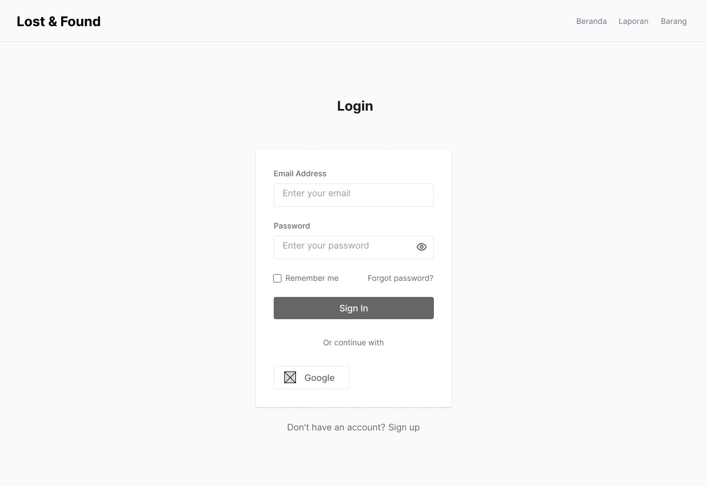

---

## Register
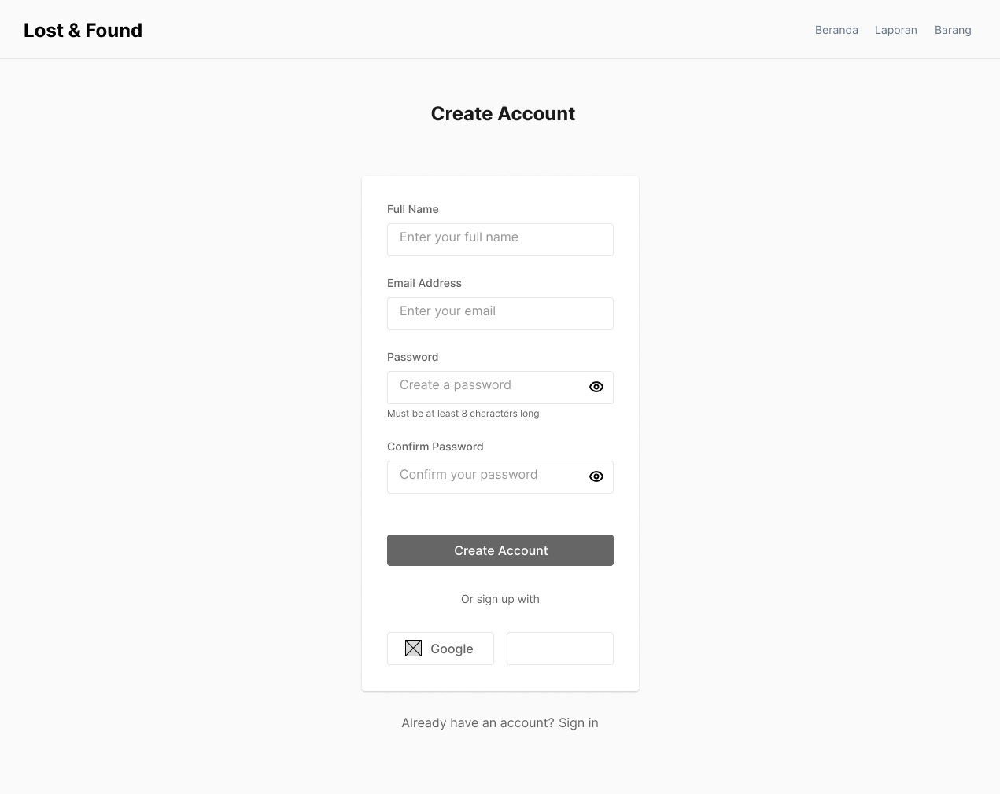

---

## Beranda
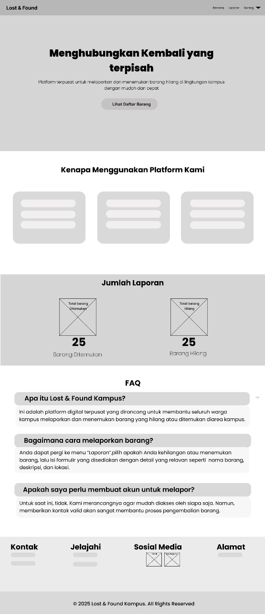

---

## Barang
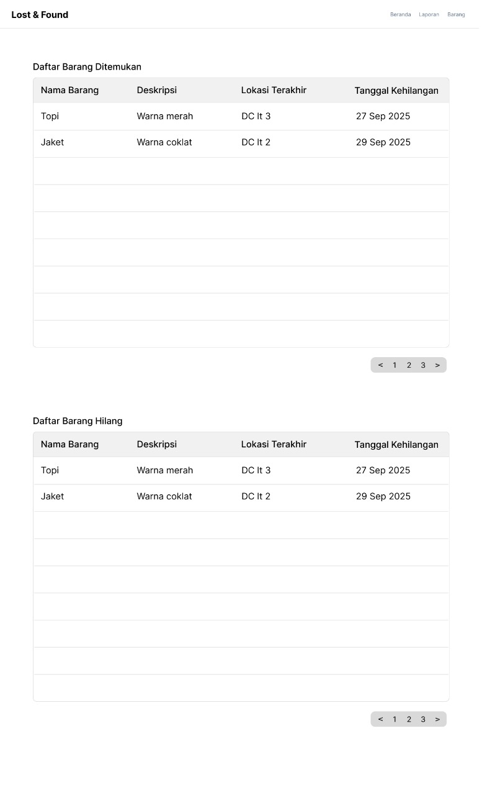

---

## Report
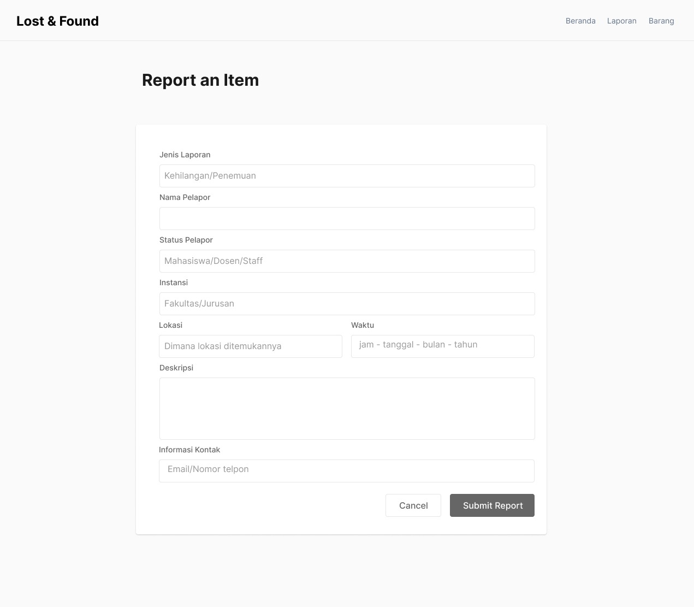

---

## ERD
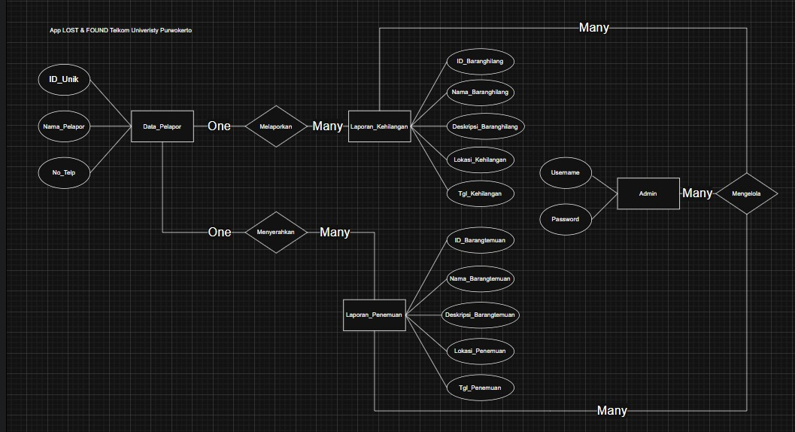

---

## Normalisasi
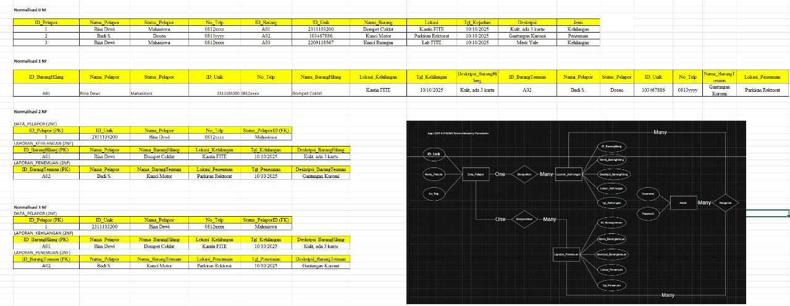

---

## Class Diagram
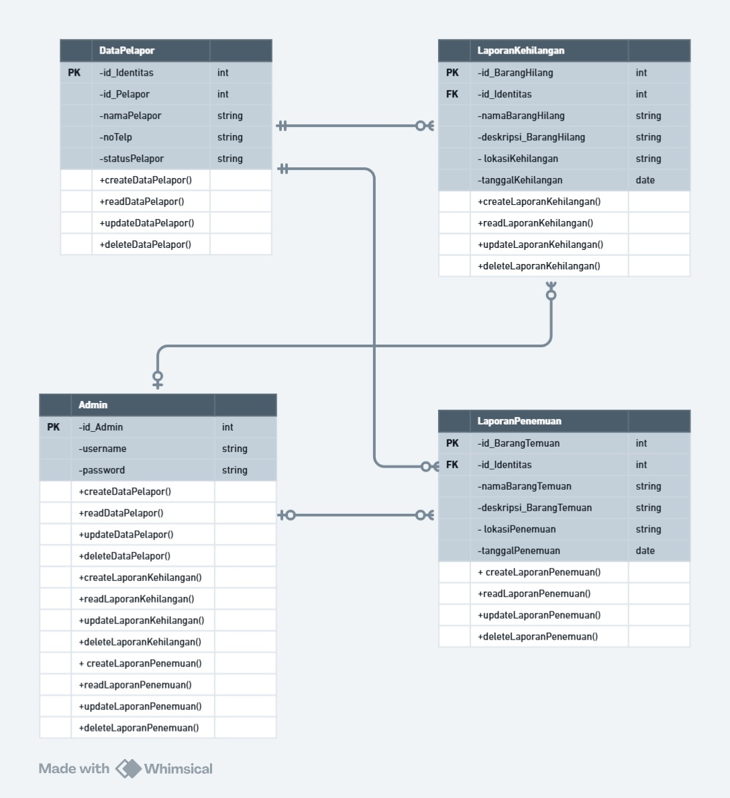

---

## Usecase Diagram
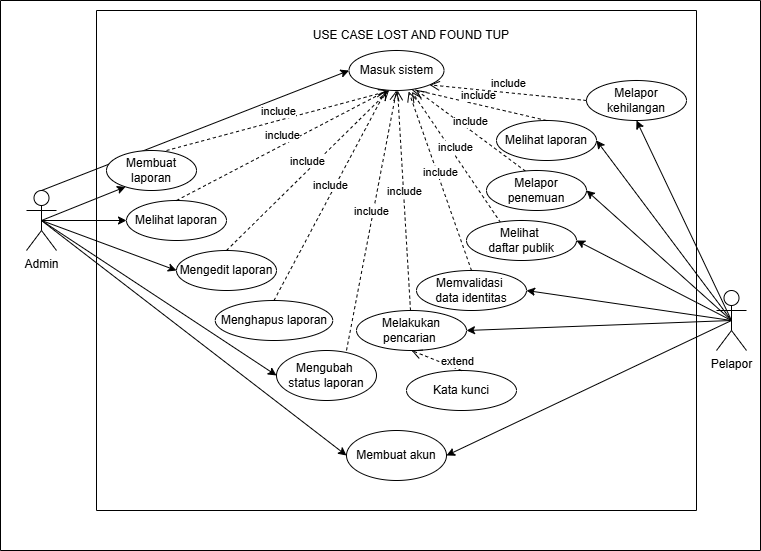

---

## Activity Diagram Login Register
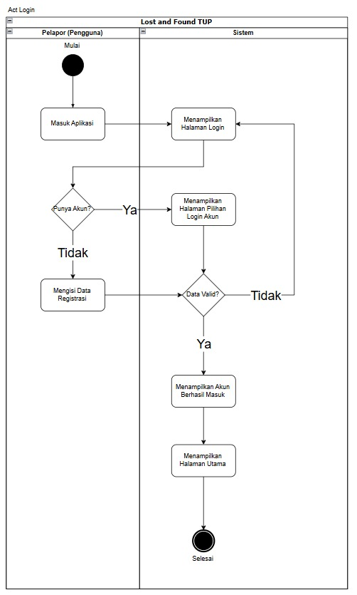

---

## Activity Diagram Laporan Penemuan
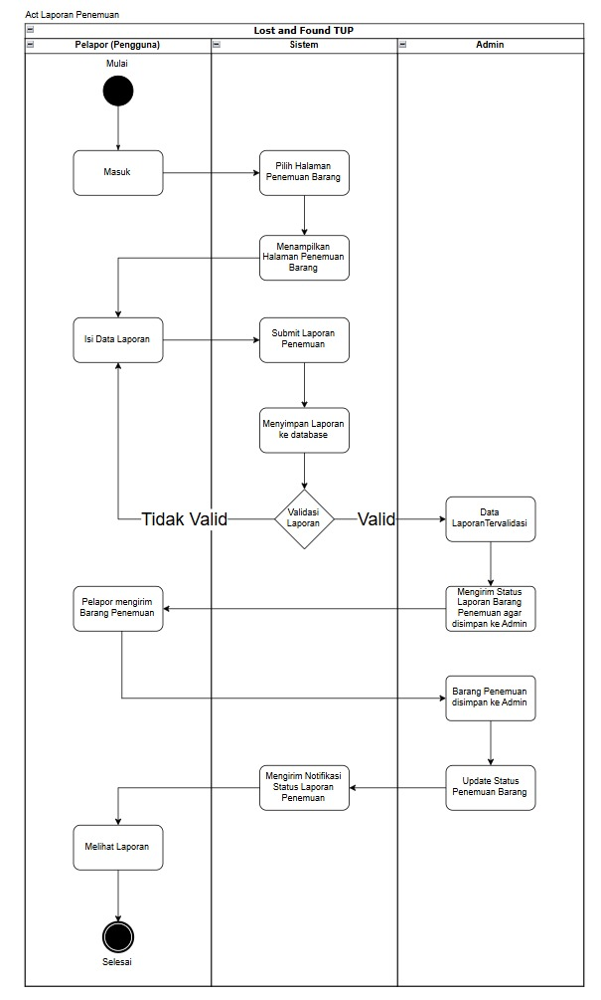

---

## Activity Diagram Kehilangan
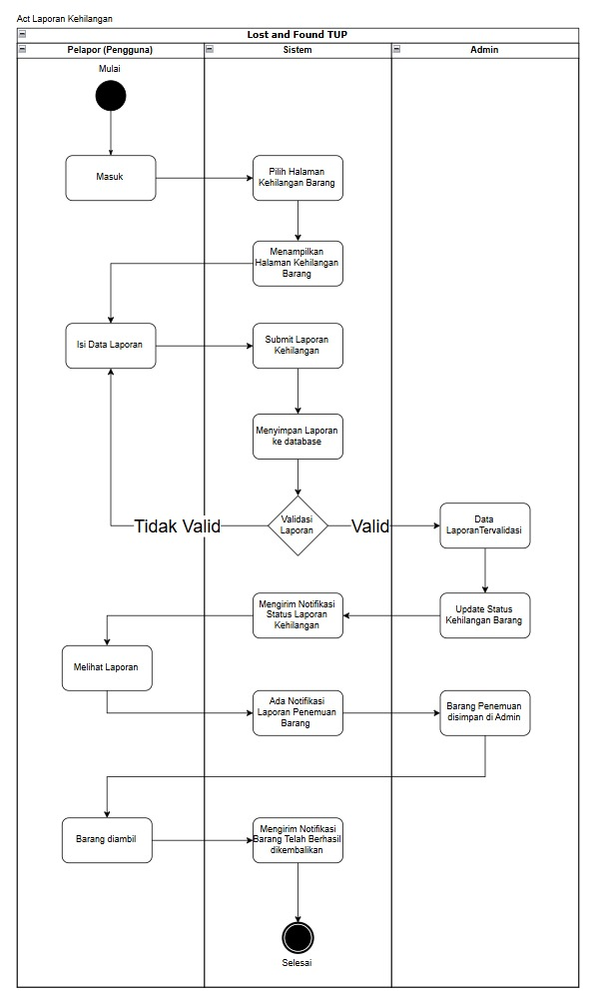

---
## Sequence Diagram Laporan Penemuan
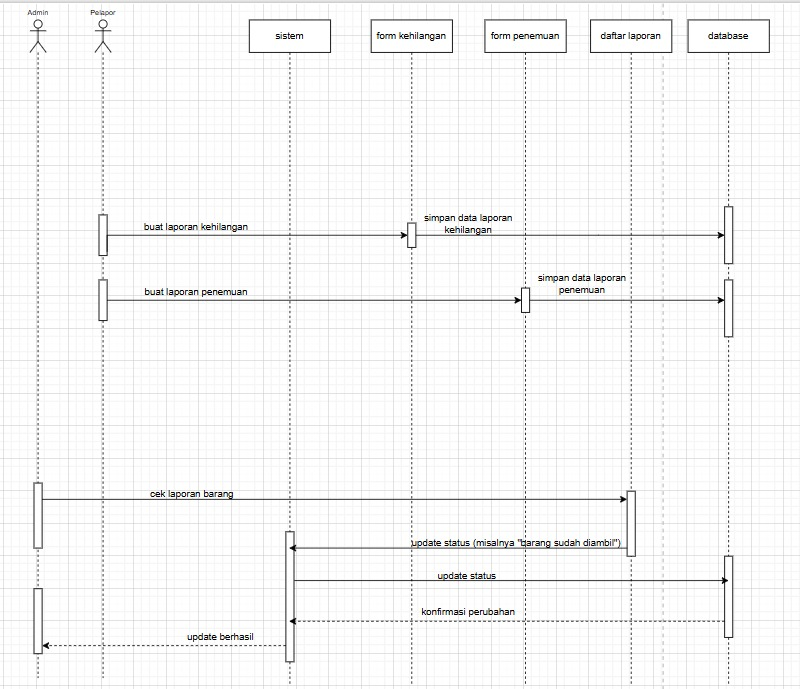

---

## Sequence Diagram Login Register
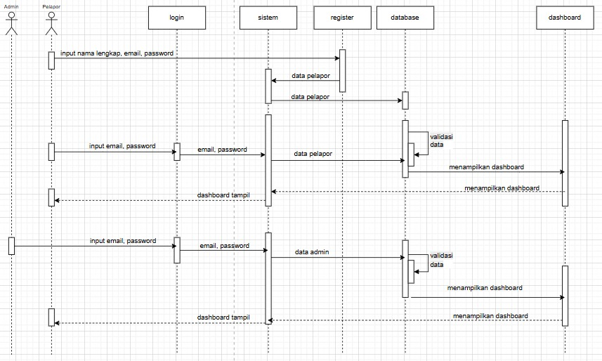

---
