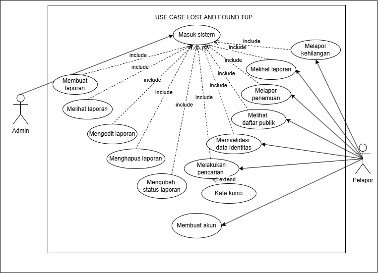

# Wireframe

Dokumentasi wireframe untuk web Lost&Found.  
Berikut adalah tampilan dari beberapa halaman utama:

---

## Login

---

## Register

---

## Beranda

---

## Barang

---

## Report

---

## ERD

---

## Normalisasi

---

## Class Diagram

---

## Usecase Diagram

---

## Activity Diagram

---
## Sequence Diagram

---
